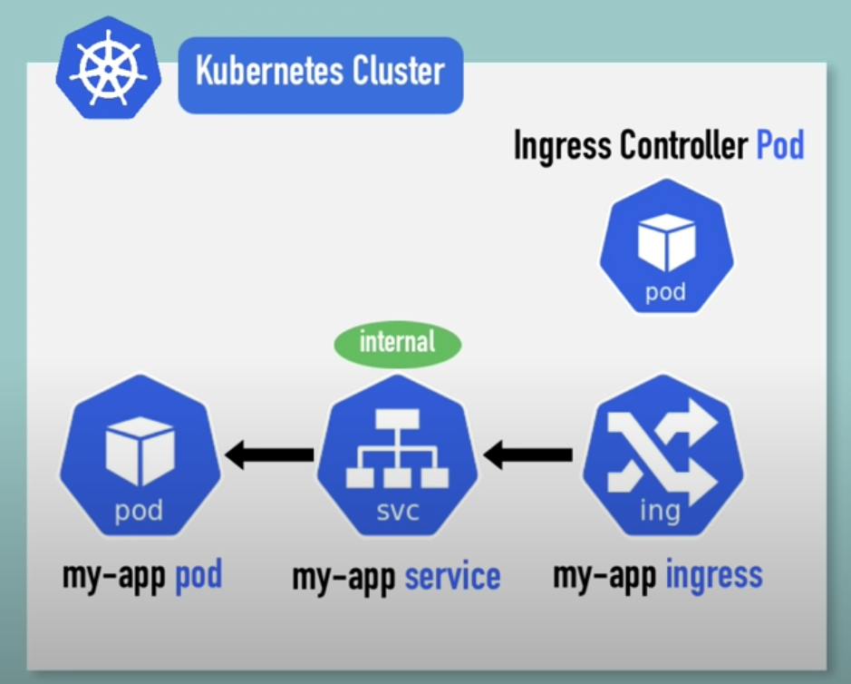
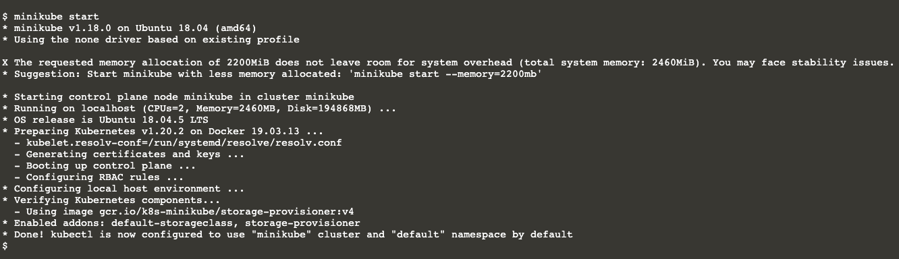
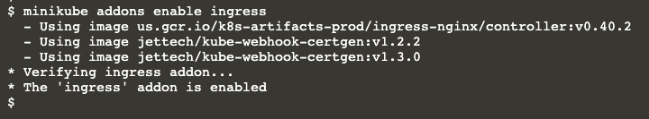
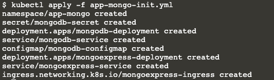
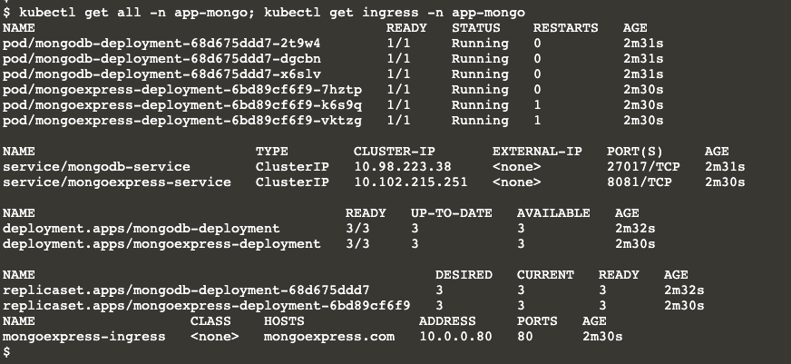

# Mongo Application




## To run this application using this configuration yaml file please follow below step.

1. Start minikube
```
minikube start
```


2. Enable ingress addon using minikube
```
minikube addons enable ingress
```


3. Launch configuration for mongo application
```
kubectl apply -f app-mongo-init.yml
```


4. Verify mongo application
```
kubectl get all -n app-mongo; kubectl get ingress -n app-mongo
```



## Takeaway points
* This application is handeling:
  1. Single domain and single path routing for ingress; You can configure it based on your requirement w.r.t. multidomain or multiple path type routing by updating ingress file.
  2. Protocol "http" only; You can configure it based on your requirement w.r.t. secure protocol by creating secret for the tls(ssl) and attaching it in ingress.
